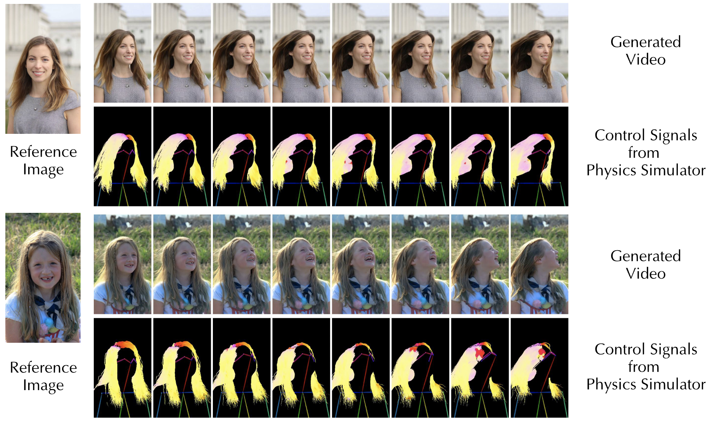

# [ECCV'26] ControlHair: Synergizing Physics Simulator and Video Diffusion for Controllable Dynamic Hair Rendering

<h3 align="center">
  <a href="https://linwk20.github.io/controlhair-web/">🌐 Project Page</a>
  &nbsp;·&nbsp;
  <a href="https://arxiv.org/abs/2509.21541">📄 Paper</a>
  &nbsp;·&nbsp;
  <a href="https://github.com/linwk20/ControlHair">💻 Code</a>
</h3>

<h3 align="center">
  <a href="https://huggingface.co/WK1997/control-hair-step-10000">🤗 Model (Private)</a>
  &nbsp;·&nbsp;
  <a href="https://huggingface.co/datasets/WK1997/control-hair-480p-dataset">🤗 ControlHair-10K Dataset (Private)</a>
</h3>

<p align="center"><strong>European Conference on Computer Vision (ECCV) 2026</strong></p>

<p align="center">
  
</p>

ControlHair combines a physics simulator with conditional video diffusion for
controllable dynamic hair rendering. The public workflow is organized in this
order:

1. 🎬 **Diffusion inference** — the default and simplest path. Run the released
   input/control examples or your own prepared control video.
2. 🌬️ **Physics simulation** — optional DiffLocks hair reconstruction and Blender
   dynamics for users who want to generate new motion.
3. 🎛️ **Control-signal extraction** — convert the Blender renders into the
   strand-orientation and pose video consumed by diffusion. After this step,
   return to Step 1 and run Diffusion Inference with your own reference image
   and generated control signal.

The optional full-generation path is substantially harder to install. It needs
separately licensed checkpoints, Blender 4.1.1, private scene templates,
OpenEXR, HairStep, DWPose, and compatible CUDA drivers.

## 🗂️ Repository layout

```text
ControlHair/
├── inference/              # diffusion entry point
├── training/               # model training launcher
├── physics_simulation/     # optional DiffLocks + Blender wrappers
├── control_signal/         # optional simulation-to-control extraction
├── examples/               # compact input/control/output examples
├── scripts/                # setup and asset preparation
├── third_party/patches/    # verified patches; upstream source is not vendored
├── configs/                # pinned revisions and model endpoints
└── tools/                  # example preparation and verification
```

UniAnimate-DiT and DiffLocks are retrieved from their official repositories at
pinned commits. ControlHair applies small checksum-verified patches locally;
their source trees are not redistributed here.

## 1. 🎬 Diffusion inference

### 🚀 Install

Requirements: Linux, Python 3.10+, FFmpeg, and an NVIDIA GPU. The paper profile
uses PyTorch 2.5.0/CUDA 12.4. RTX 50-series GPUs require the Blackwell profile.

```bash
# H100 / paper environment
bash scripts/setup.sh --profile paper

# RTX 5090 / Blackwell 50-series
bash scripts/setup.sh --profile blackwell

source .venv/bin/activate
```

Setup retrieves UniAnimate-DiT commit
`61d882c25385042f0cf5bcdaf6853238d9756d68`, applies the ControlHair
four-file patch, verifies its SHA-256 manifest, and installs it.

### 📦 Prepare models

```bash
python scripts/prepare_models.py --component wan

# Requires access to the private ControlHair model.
python scripts/prepare_models.py \
  --component controlhair \
  --accept-third-party-licenses

export CONTROLHAIR_CHECKPOINT="$PWD/models/controlhair/control-hair-step-10000"
export WAN_MODEL_DIR="$PWD/models/wan/Wan2.1-I2V-14B-720P"
```

The private repository provides a verified 2.29 GiB inference-only checkpoint
containing 800 LoRA tensors and 26 conditioning-encoder tensors.

### ▶️ Run the released example

```bash
bash inference/run_example.sh
```

Output:

```text
artifacts/inference/motion_01/wan_480P_trial_0.mp4
```

Use another released example:

```bash
bash inference/run_example.sh \
  examples/wind_control/wind_01 \
  artifacts/inference/wind_01
```

### 🖼️ Released examples

Each package under [`examples/`](examples/) contains:

```text
example/
├── input.png
├── control.mp4
├── expected_output.mp4
├── preview_triptych.mp4
└── metadata.json
```

The reference portraits are sourced from the
[Flickr-Faces-HQ dataset](https://github.com/NVlabs/ffhq-dataset). FFHQ dataset
materials are provided under CC BY-NC-SA 4.0, while individual images retain
their original Flickr licenses and attribution requirements. The generated
controls and outputs are documented in each package's `metadata.json`.

## 2. 🌬️ Optional physics simulation and control extraction

Users who want to generate a new control signal from a portrait must install
the advanced physics environment. Install Git LFS before cloning so the two
ControlHair Blender templates are fetched with the repository:

```bash
bash scripts/setup_physics.sh \
  --profile paper \
  --accept-restricted-licenses \
  --download-checkpoints
source .venv-physics/bin/activate
```

This workflow:

- retrieves DiffLocks commit
  `fcc73747dc60320c30228b6711000a53fc0c9d84`;
- applies and verifies the three-file ControlHair DiffLocks/Blender patch;
- retrieves HairStep;
- verifies and installs the two Git LFS Blender templates;
- downloads the official Blender 4.1.1 Linux x64 build and verifies its
  published SHA-256 checksum.

`--download-checkpoints` invokes the official DiffLocks downloader and prepares
the HairStep strand network after explicit license acceptance. Omit the flag if
you only want to prepare the environment first.

Run hair reconstruction and simulation:

```bash
python physics_simulation/run.py \
  portrait.png \
  artifacts/physics/portrait_wind \
  --dynamics wind
```

Supported dynamics are `wind`, `motion`, `wind-motion`, and `sudden-wind`.

Extract the diffusion control signal:

```bash
python scripts/prepare_models.py --component unianimate
source scripts/model_env.sh
python -m control_signal.run artifacts/physics/portrait_wind
```

The resulting directory contains `input.png` and `control.mp4`, so it can be
passed directly to diffusion:

```bash
bash inference/run_example.sh artifacts/physics/portrait_wind
```

This stage may require manual debugging for Blender scenes, SMPL-X add-ons,
CUDA/ONNX Runtime, portrait geometry, and restricted checkpoints. Users only
running the released controls do not need any of it.

## 3. 🧠 Training with the provided dataset

The prepared [ControlHair-10K dataset](https://huggingface.co/datasets/WK1997/control-hair-480p-dataset)
uses [YOLOFace](https://github.com/akanametov/yolo-face) for portrait cropping,
[SegFormer human parsing](https://huggingface.co/matei-dorian/segformer-b5-finetuned-human-parsing)
for hair masks, and [DWPose](https://github.com/IDEA-Research/DWPose) for pose
conditioning. Authorized users can download the prepared 480p dataset directly:

```bash
python scripts/prepare_dataset.py \
  --component controlhair_480p \
  --accept-private-dataset-terms
```

Prepare the base models and launch training:

```bash
python scripts/prepare_models.py \
  --component wan \
  --component unianimate

source scripts/model_env.sh
export DATASET_PATH="$PWD/datasets/control-hair-480p"
export CUDA_VISIBLE_DEVICES=0,1,2,3
bash training/train.sh
```

The default configuration uses LoRA rank 128, learning rate `1e-4`,
gradient checkpointing, and DeepSpeed stage 2. The released checkpoint was
trained for 10K steps, although checkpoints around 5K steps can already produce
strong results. Continuing to 10K may overfit and can reduce stability in some
scenes, so we recommend selecting the checkpoint using validation results and
qualitative evaluation rather than assuming the final step is always best.
For a 5K-step run, use `MAX_STEPS=5000 bash training/train.sh`; the launcher
defaults to the released 10K-step schedule.

## ⏱️ Runtime

The paper reports the following runtime on an AMD EPYC 9354 CPU and NVIDIA RTX
Pro 6000 Max-Q GPU:

| Stage | Time |
|---|---:|
| Hair reconstruction | 22 s |
| Blender simulation | 326 s |
| Control-signal extraction | 21 s |
| Video diffusion | 853 s |
| Full pipeline | 1,222 s (~20 min) |

ControlHair targets offline generation rather than real-time rendering.

Additional details are in [third-party notices](THIRD_PARTY_NOTICES.md) and the
focused READMEs under `inference/` and `control_signal/`.

## 📖 Citation

```bibtex
@inproceedings{lin2026controlhair,
  title     = {{ControlHair}: Synergizing Physics Simulator and Video Diffusion for Controllable Dynamic Hair Rendering},
  author    = {Lin, Weikai and Li, Haoxiang and Zhu, Yuhao},
  booktitle = {European Conference on Computer Vision (ECCV)},
  year      = {2026}
}
```

## 🙏 Acknowledgements

ControlHair builds on
[UniAnimate-DiT](https://github.com/ali-vilab/UniAnimate-DiT),
[DiffSynth-Studio](https://github.com/modelscope/DiffSynth-Studio),
[Wan 2.1](https://github.com/Wan-Video/Wan2.1),
[DiffLocks](https://github.com/Meshcapade/difflocks),
[Blender](https://www.blender.org/),
[DWPose](https://github.com/IDEA-Research/DWPose),
[HairStep](https://github.com/GAP-LAB-CUHK-SZ/HairStep),
[SegFormer human parsing](https://huggingface.co/matei-dorian/segformer-b5-finetuned-human-parsing),
and [YOLOFace](https://github.com/akanametov/yolo-face).

## 📜 License

ControlHair's original code is released under the [MIT License](LICENSE).
Third-party repositories, patches, checkpoints, Blender templates, datasets,
and FFHQ-derived example media retain their own terms. See
[THIRD_PARTY_NOTICES.md](THIRD_PARTY_NOTICES.md).
